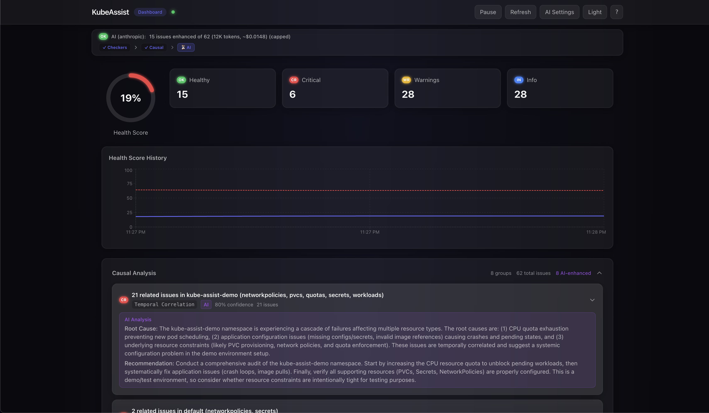
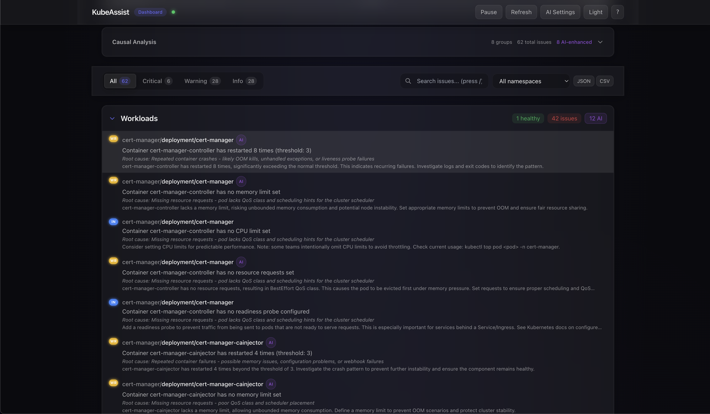
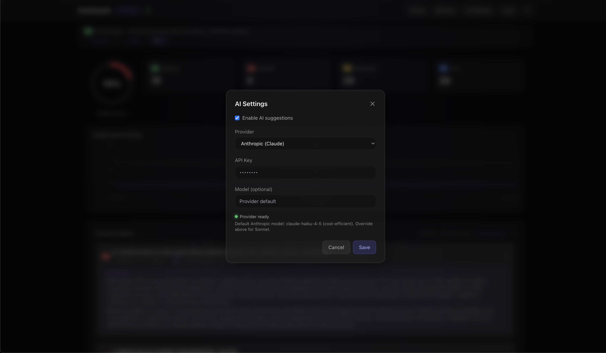
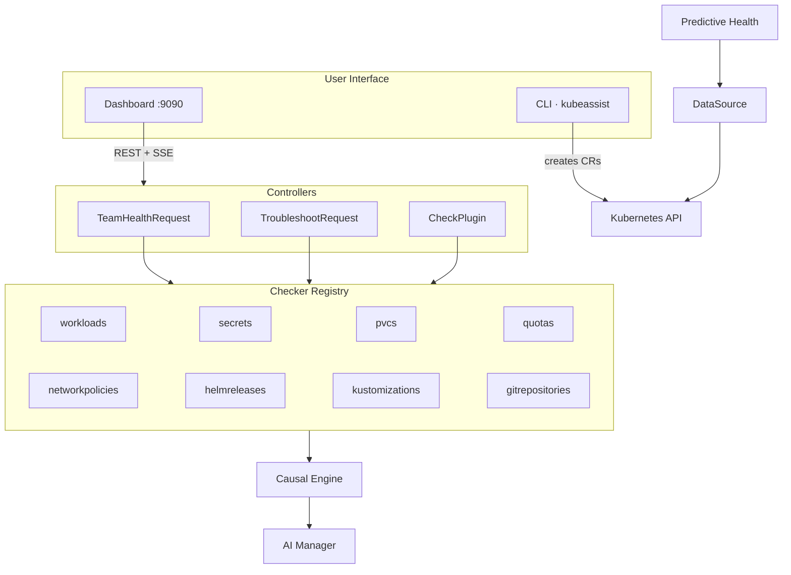

# KubeAssist

[](https://github.com/osagberg/kube-assist-operator/actions/workflows/test.yml)
[](https://github.com/osagberg/kube-assist-operator/actions/workflows/lint.yml)
[](https://go.dev/)
[](https://kubernetes.io/)
[](LICENSE)

KubeAssist is a Kubernetes operator and CLI for cluster diagnostics.

It combines health checks, troubleshooting workflows, causal correlation, and optional AI-assisted explanations into one deployable system, with a built-in dashboard.



## What KubeAssist Does

- Runs health checks across workloads, secrets, storage, quotas, network policies, and Flux resources
- Supports custom CEL-based checks through `CheckPlugin` CRDs
- Provides actionable issue output with copyable `kubectl` commands
- Correlates related failures across checkers (causal analysis)
- Supports optional AI enhancement (Anthropic, OpenAI, NoOp)
- Exposes a dashboard with live updates over SSE
- Supports direct Kubernetes mode and console-backed multi-cluster mode

## Quick Start

### 1. Build the CLI

```bash
git clone https://github.com/osagberg/kube-assist-operator.git
cd kube-assist-operator
make install-cli
```

### 2. Run Diagnostics

```bash
# Legacy workload diagnostics (default: all namespaces)
kubeassist

# Scope workload diagnostics to one namespace
kubeassist --all-namespaces=false production

# Team health checks
kubeassist health
kubeassist health -n production,staging

# JSON output
kubeassist health -o json
```

### 3. Deploy the Operator

```bash
# Helm (recommended)
helm install kube-assist charts/kube-assist \
  --namespace kube-assist-system \
  --create-namespace \
  --set dashboard.enabled=true

# Kustomize
make deploy IMG=ghcr.io/osagberg/kube-assist-operator:v1.11.2
```

## Core Custom Resources

### `TeamHealthRequest`

Runs multi-checker health analysis over a selected scope.

```yaml
apiVersion: assist.cluster.local/v1alpha1
kind: TeamHealthRequest
metadata:
  name: platform-health
spec:
  scope:
    namespaces:
      - frontend
      - backend
  checks:
    - workloads
    - secrets
    - helmreleases
  ttlSecondsAfterFinished: 600
```

### `TroubleshootRequest`

Runs targeted diagnostics for a workload and captures output.

```yaml
apiVersion: assist.cluster.local/v1alpha1
kind: TroubleshootRequest
metadata:
  name: diagnose-my-app
  namespace: production
spec:
  target:
    kind: Deployment
    name: my-app
  actions:
    - diagnose
    - logs
    - events
  tailLines: 100
  ttlSecondsAfterFinished: 300
```

### `CheckPlugin`

Adds runtime-checkable custom health rules using CEL.

```yaml
apiVersion: assist.cluster.local/v1alpha1
kind: CheckPlugin
metadata:
  name: team-policy
spec:
  displayName: Team Policy
  resource:
    apiVersion: apps/v1
    kind: Deployment
  rule:
    expression: "has(object.spec.template.spec.securityContext.runAsNonRoot)"
    severity: Warning
    message: "runAsNonRoot should be configured"
```

## Health Checkers

Built-in checkers:

- `workloads`
- `secrets`
- `pvcs`
- `quotas`
- `networkpolicies`
- `helmreleases`
- `kustomizations`
- `gitrepositories`

For exact checker logic and thresholds, see the implementations under `internal/checker/`.

## Dashboard

The dashboard is embedded in the operator binary (`go:embed`) and served from the same process.






### Enable Dashboard

```bash
# Local development
make run ARGS="--enable-dashboard"

# Helm
helm install kube-assist charts/kube-assist \
  --namespace kube-assist-system \
  --create-namespace \
  --set dashboard.enabled=true

# Access
kubectl port-forward -n kube-assist-system svc/kube-assist-dashboard 9090:9090
open http://localhost:9090
```

If `dashboard.authToken` is set, TLS must also be configured unless `dashboard.allowInsecureHttp=true` is explicitly set for local development.

### Dashboard API Endpoints

When `dashboard.authToken` is configured, all `/api/*` endpoints require authentication (cookie or Bearer token).

| Endpoint | Method | Description |
|----------|--------|-------------|
| `/` | GET | Dashboard UI |
| `/api/health` | GET | Current health data |
| `/api/health/history` | GET | Health history (`?last=N`, `?since=RFC3339`) |
| `/api/events` | GET | SSE stream |
| `/api/check` | POST | Trigger immediate check |
| `/api/settings/ai` | GET, POST | Read/update AI settings |
| `/api/settings/ai/catalog` | GET | Model catalog |
| `/api/causal/groups` | GET | Causal groups |
| `/api/explain` | GET | AI cluster explanation |
| `/api/prediction/trend` | GET | Trend projection |
| `/api/clusters` | GET | Available clusters |
| `/api/fleet/summary` | GET | Fleet-level summary |
| `/api/troubleshoot` | GET, POST | List/create TroubleshootRequest |
| `/api/issues/acknowledge` | POST, DELETE | Acknowledge/unacknowledge issue |
| `/api/issues/snooze` | POST, DELETE | Snooze/unsnooze issue |
| `/api/issue-states` | GET | Active issue states |
| `/api/capabilities` | GET | Frontend feature flags |

## AI Integration

Supported providers:

| Provider | Description |
|----------|-------------|
| Anthropic | Structured analysis and explain mode |
| OpenAI | Alternative provider for analysis and explain mode |
| NoOp | Disabled behavior for testing/development |

AI behavior includes batching, caching, severity gating, deduplication, budget controls, and sanitization before provider calls.

Full configuration and operational details:

- [AI Integration Guide](docs/ai-integration.md)

## Architecture



Detailed diagrams:

- [Architecture Index](docs/architecture/INDEX.md)
- [System Overview](docs/architecture/00-system-overview.md)
- [Reconciliation Flows](docs/architecture/01-reconciliation-flows.md)
- [Checker & Causal Engine](docs/architecture/02-checker-registry.md)
- [AI, Dashboard & DataSource](docs/architecture/03-ai-dashboard-datasource.md)

## Helm Configuration

Common values:

| Parameter | Default | Description |
|-----------|---------|-------------|
| `dashboard.enabled` | `false` | Enable dashboard |
| `dashboard.authToken` | `""` | Auth token for dashboard API |
| `dashboard.allowInsecureHttp` | `false` | Permit auth without TLS (dev only) |
| `dashboard.tls.enabled` | `false` | Enable dashboard TLS |
| `dashboard.maxSSEClients` | `100` | Max concurrent SSE clients |
| `dashboard.checkInterval` | `"30s"` | Health check polling interval |
| `dashboard.sseBufferSize` | `10` | SSE client channel buffer capacity |
| `dashboard.historySize` | `100` | Health history ring buffer capacity |
| `ai.enabled` | `false` | Enable AI suggestions |
| `ai.provider` | `noop` | Provider: anthropic/openai/noop |
| `ai.apiKeySecretRef.name` | `""` | Secret containing API key |
| `ai.analysisTimeout` | `"90s"` | AI analysis context timeout |
| `ai.maxIssuesPerBatch` | `15` | Max issues sent to AI per batch |
| `networkPolicy.enabled` | `true` | Enable network policy |
| `networkPolicy.ingressMode` | `strict` | Ingress policy mode |
| `datasource.type` | `kubernetes` | `kubernetes` or `console` |
| `datasource.consoleURL` | `""` | Console backend URL (required for console mode) |

Full values reference:

- [charts/kube-assist/values.yaml](charts/kube-assist/values.yaml)

## Security

### Runtime and API

- Constant-time token comparison for auth
- Security headers enabled on dashboard responses
- TLS required when auth token is set (unless explicitly overridden for local dev)
- Configurable session TTL and request rate limiting
- NetworkPolicy defaults enabled in chart

### Supply Chain and Release Artifacts

- GitHub Actions pinned by SHA
- Release images built with distroless base
- Release workflow signs images with cosign keyless and attaches SPDX SBOM attestation
- Trivy scan runs in release workflow

Verify release artifacts:

```bash
cosign verify ghcr.io/osagberg/kube-assist-operator:<tag> \
  --certificate-identity-regexp="https://github.com/osagberg/kube-assist-operator" \
  --certificate-oidc-issuer="https://token.actions.githubusercontent.com"

cosign verify-attestation ghcr.io/osagberg/kube-assist-operator:<tag> \
  --type spdxjson \
  --certificate-identity-regexp="https://github.com/osagberg/kube-assist-operator" \
  --certificate-oidc-issuer="https://token.actions.githubusercontent.com"
```

## Metrics

Prometheus endpoint: `:8080/metrics`

Key metrics include reconciliation counts/durations, issue counts, and AI pipeline counters/gauges.

## CI/CD

| Workflow | File | Trigger | Purpose |
|----------|------|---------|---------|
| Lint | `.github/workflows/lint.yml` | push/PR | Go + Helm linting |
| Tests | `.github/workflows/test.yml` | push/PR | unit/integration tests + govulncheck |
| E2E | `.github/workflows/test-e2e.yml` | push/PR | Kind-based e2e suite |
| Release | `.github/workflows/release.yml` | tag `v*` | build/push/sign/SBOM/scan/release |

## Development

```bash
# tests
make test

# lint
make lint

# run operator locally
make run

# run with dashboard enabled
make run ARGS="--enable-dashboard"

# build image
make docker-build IMG=ghcr.io/osagberg/kube-assist-operator:dev

# generate manifests
make manifests

# install CRDs
make install

# build/install CLI
make install-cli
```

## Documentation

- [Architecture Diagrams](docs/architecture/INDEX.md)
- [AI Integration Guide](docs/ai-integration.md)
- [Troubleshooting Guide](docs/troubleshooting.md)

## Roadmap

Next priorities: server.go decomposition, test coverage targets, schema-enforced AI outputs, ServiceMonitor Helm templates.

For the full roadmap with dependency graph and implementation details, see the project documentation.

## License

Apache License 2.0 — see [LICENSE](LICENSE).
