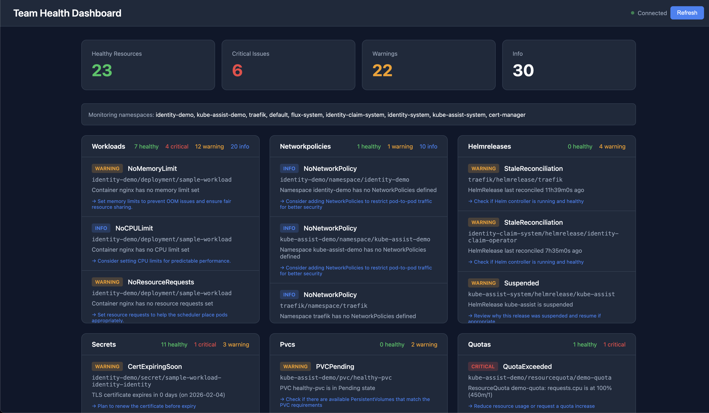

# KubeAssist

[](https://go.dev/)
[](https://kubernetes.io/)
[](LICENSE)
[](https://github.com/osagberg/kube-assist-operator/actions/workflows/ci.yaml)

**Kubernetes operator for workload diagnostics and cluster health monitoring.**

One command to diagnose your entire cluster. KubeAssist provides instant visibility into workload issues, certificate expiration, resource quotas, Flux GitOps status, and more -- with copy-able kubectl remediation commands for every issue it finds.



### Why KubeAssist?

Most monitoring tools tell you *what* is broken. KubeAssist tells you *why* and *how to fix it*.

- **Zero-config value** -- deploy the operator, get immediate health insights with no setup
- **Full-stack Kubernetes coverage** -- 8 checkers across workloads, storage, networking, secrets, quotas, and Flux GitOps
- **Actionable, not just informational** -- every issue includes copy-able `kubectl` commands, root causes, and links to upstream docs
- **AI root cause analysis** -- optional Anthropic/OpenAI integration for context-aware diagnostics, configurable at runtime
- **GitOps-native** -- first-class Flux CD integration with graceful degradation when Flux isn't installed
- **Causal analysis** -- temporal correlation, resource graph ownership chains, cross-checker rules, enhanced AI root cause analysis
- **Enterprise patterns** -- DataSource abstraction, pluggable notifiers, webhook validation, TTL cleanup, leader election
- **Single binary** -- dashboard, API, operator, and CLI all compile into one Go binary with zero external dependencies

---

## Table of Contents

- [Features](#features)
- [Quick Start](#quick-start)
- [CLI Reference](#cli-reference)
- [Health Checkers](#health-checkers)
- [Custom Resources](#custom-resources)
- [Dashboard](#dashboard)
- [AI Integration](#ai-integration)
- [Helm Installation](#helm-installation)
- [Architecture](#architecture)
- [CI/CD Pipeline](#cicd-pipeline)
- [Development](#development)
- [License](#license)

---

## Features

### Instant Diagnostics
- **8 built-in checkers** covering workloads, secrets, storage, quotas, network policies, and Flux GitOps
- **Severity levels** (Critical/Warning/Info) with actionable fix suggestions
- **Copy-able kubectl commands** on every issue -- paste and run, no guessing
- **CLI and CRD interfaces** -- use whichever fits your workflow

### Modern React Dashboard
- **React 19 + Vite + TypeScript + Tailwind CSS** -- embedded SPA via `go:embed`, single binary
- **Indigo accent** with dark/light themes, responsive layout
- **Runtime AI settings** -- enable AI, pick a provider, enter your API key, and choose a model, all from the dashboard without restarting the operator
- **Live updates** via Server-Sent Events (SSE) with auto-reconnect, pause/resume
- **Health score history** -- line chart visualization powered by recharts
- **Connection indicator** -- green/yellow/red dot showing SSE status
- **Toast notifications** for user actions and background events
- **Search & filter** by namespace, severity, text
- **Export** reports as JSON or CSV
- **Keyboard shortcuts** for power users
- **Health score** visualization with animated SVG ring
- **Causal timeline** -- expandable group cards showing correlated issues with severity colors, rule labels, confidence scores, and root cause display

### AI-Powered Suggestions
- **Runtime configuration** -- switch providers and models from the dashboard at any time
- **Enhanced diagnostics** with AI-generated root cause analysis
- **Provider options** -- Anthropic Claude, OpenAI, or NoOp for testing
- **Thread-safe AI Manager** -- `Reconfigure()` swaps providers without downtime
- **Data sanitization** -- sensitive data redacted before AI calls
- **Configurable** via CLI flags, env vars, Helm values, or the dashboard UI

### GitOps Native
- **Flux integration** for HelmReleases, Kustomizations, GitRepositories
- **Graceful degradation** -- Flux checkers automatically skip if Flux isn't installed
- **Stale reconciliation detection** -- catch GitOps pipelines that stopped syncing

### Production Ready
- **Leader election** for HA deployments
- **Prometheus metrics** for observability
- **Minimal RBAC** -- least-privilege, read-only access to cluster resources
- **Distroless container** with OCI labels -- secure, minimal attack surface
- **Network policy** template for restricted egress
- **186+ test cases** -- unit, integration, and E2E coverage across all packages
- **Validating webhooks** reject invalid CRs at admission time
- **TTL auto-cleanup** for completed/failed CRs (`ttlSecondsAfterFinished`)
- **Security scanning** -- govulncheck in CI, Trivy container scan on release, Dependabot for automated dependency updates
- **DataSource abstraction** -- pluggable backend interface (direct K8s API or enterprise cache)
- **Webhook notifications** -- `spec.notify` on TeamHealthRequest for Slack/Mattermost/Discord/any HTTP endpoint
- **Health score history** -- in-memory ring buffer with `/api/health/history` API
- **Graceful degradation** -- Flux checkers skip cleanly when CRDs aren't installed; 50-namespace cap prevents runaway scans

---

## Quick Start

### Install the CLI

```bash
# Clone and build
git clone https://github.com/osagberg/kube-assist-operator.git
cd kube-assist-operator
make install-cli

# Or build manually
go build -o /usr/local/bin/kubeassist ./cmd/kubeassist
```

### Run Diagnostics

```bash
# Diagnose all workloads across all namespaces
kubeassist

# Run comprehensive health checks
kubeassist health

# Check specific namespaces
kubeassist health -n production,staging

# Output as JSON for CI/CD pipelines
kubeassist health -o json
```

### Deploy the Operator

```bash
# Using Helm (recommended)
helm install kube-assist charts/kube-assist \
  --namespace kube-assist-system \
  --create-namespace \
  --set dashboard.enabled=true

# Using Kustomize
make deploy IMG=ghcr.io/osagberg/kube-assist-operator:v1.7.0
```

---

## CLI Reference

### `kubeassist` — Workload Diagnostics

Scans Deployments, StatefulSets, DaemonSets, and Pods for issues.

```bash
kubeassist [namespace] [flags]
```

| Flag | Short | Default | Description |
|------|-------|---------|-------------|
| `--all-namespaces` | `-A` | `true` | Scan all namespaces |
| `--selector` | `-l` | — | Label selector (e.g., `app=api`) |
| `--output` | `-o` | `text` | Output format: `text` or `json` |
| `--watch` | `-w` | `false` | Continuous monitoring mode |
| `--workers` | — | `5` | Parallel diagnostic workers |
| `--timeout` | — | `60s` | Timeout per diagnostic |
| `--cleanup` | — | `true` | Delete CRs after displaying results |

**Examples:**

```bash
# Diagnose a specific namespace
kubeassist production

# Filter by label
kubeassist -l app=frontend

# Watch mode — continuous monitoring
kubeassist -w

# JSON output for scripting
kubeassist -o json | jq '.issues[] | select(.severity == "Critical")'
```

### `kubeassist health` — Comprehensive Health Checks

Runs all 8 checkers across specified namespaces.

```bash
kubeassist health [flags]
```

| Flag | Short | Default | Description |
|------|-------|---------|-------------|
| `--namespaces` | `-n` | current | Comma-separated namespace list |
| `--namespace-selector` | — | — | Label selector for namespaces |
| `--checks` | — | all | Comma-separated checker names |
| `--output` | `-o` | `text` | Output format: `text` or `json` |
| `--timeout` | — | `120s` | Total check timeout |
| `--cleanup` | — | `true` | Delete CR after displaying results |

**Examples:**

```bash
# Check current namespace
kubeassist health

# Check multiple namespaces
kubeassist health -n frontend,backend,database

# Check namespaces by label
kubeassist health --namespace-selector team=platform

# Run specific checkers only
kubeassist health --checks workloads,secrets,helmreleases

# JSON output
kubeassist health -o json > health-report.json
```

---

## Health Checkers

KubeAssist includes 8 built-in checkers that detect common issues:

### Workloads (`workloads`)

Checks Deployments, StatefulSets, DaemonSets, and Pods.

| Issue | Severity | Description |
|-------|----------|-------------|
| CrashLoopBackOff | Critical | Container repeatedly crashing |
| ImagePullBackOff | Critical | Cannot pull container image |
| OOMKilled | Critical | Container killed due to memory limit |
| CreateContainerConfigError | Critical | Invalid container configuration |
| Pending (Unschedulable) | Critical | Pod cannot be scheduled |
| High Restart Count | Warning | Container restarted >3 times (configurable) |
| No Resource Limits | Warning | Missing CPU/memory limits |
| No Liveness Probe | Info | Missing liveness probe |
| No Readiness Probe | Info | Missing readiness probe |

### Secrets (`secrets`)

Checks TLS certificates in Kubernetes Secrets.

| Issue | Severity | Description |
|-------|----------|-------------|
| Certificate Expired | Critical | TLS cert has expired |
| Certificate Expiring | Warning | Cert expires within 30 days (configurable) |
| Empty Secret | Warning | Secret has no data |

### PVCs (`pvcs`)

Checks PersistentVolumeClaims.

| Issue | Severity | Description |
|-------|----------|-------------|
| PVC Lost | Critical | PVC in Lost state |
| PVC Pending | Warning | PVC waiting to be bound |
| High Capacity Usage | Warning | >85% capacity used (configurable) |

### Quotas (`quotas`)

Checks ResourceQuotas.

| Issue | Severity | Description |
|-------|----------|-------------|
| Quota Exceeded | Critical | Resource usage over quota |
| Quota Near Limit | Warning | >80% of quota used (configurable) |

### Network Policies (`networkpolicies`)

Checks NetworkPolicy coverage.

| Issue | Severity | Description |
|-------|----------|-------------|
| No NetworkPolicy | Info | Namespace has no network policies |
| Overly Permissive | Info | Policy allows all ingress/egress |

### HelmReleases (`helmreleases`)

Checks Flux HelmRelease resources.

| Issue | Severity | Description |
|-------|----------|-------------|
| Release Failed | Critical | Helm upgrade/install failed |
| Stale Reconciliation | Warning | Not reconciled in >1 hour |
| Suspended | Info | Release is suspended |

### Kustomizations (`kustomizations`)

Checks Flux Kustomization resources.

| Issue | Severity | Description |
|-------|----------|-------------|
| Build Failed | Critical | Kustomize build failed |
| Stale Reconciliation | Warning | Not reconciled in >1 hour |
| Suspended | Info | Kustomization is suspended |

### GitRepositories (`gitrepositories`)

Checks Flux GitRepository resources.

| Issue | Severity | Description |
|-------|----------|-------------|
| Clone Failed | Critical | Cannot clone repository |
| Auth Failed | Critical | Authentication failure |
| Stale Fetch | Warning | Not fetched in >1 hour |
| Suspended | Info | Repository is suspended |

---

## Custom Resources

### TroubleshootRequest

On-demand diagnostics for a specific workload.

```yaml
apiVersion: assist.cluster.local/v1alpha1
kind: TroubleshootRequest
metadata:
  name: diagnose-my-app
  namespace: production
spec:
  target:
    kind: Deployment          # Deployment, StatefulSet, DaemonSet, Pod, ReplicaSet
    name: my-app
  actions:
    - diagnose                # Analyze pod status and errors
    - logs                    # Collect container logs
    - events                  # Collect related events
    - all                     # All of the above
  tailLines: 100              # Log lines to collect (default: 100)
  ttlSecondsAfterFinished: 300  # Auto-delete after 5 min (optional)
```

**Status fields:**

| Field | Description |
|-------|-------------|
| `phase` | Pending, Running, Completed, or Failed |
| `issues` | List of detected issues with severity and suggestions |
| `logsConfigMap` | ConfigMap containing collected logs |
| `eventsConfigMap` | ConfigMap containing related events |
| `completedAt` | Timestamp when the request completed or failed |

### TeamHealthRequest

Comprehensive health check across namespaces.

```yaml
apiVersion: assist.cluster.local/v1alpha1
kind: TeamHealthRequest
metadata:
  name: platform-health
spec:
  scope:
    # Option 1: Explicit namespace list
    namespaces:
      - frontend
      - backend
      - database

    # Option 2: Label selector
    # namespaceSelector:
    #   matchLabels:
    #     team: platform

    # Option 3: Current namespace only
    # currentNamespaceOnly: true

  checks:                     # Empty = all checkers
    - workloads
    - secrets
    - helmreleases

  ttlSecondsAfterFinished: 600  # Auto-delete after 10 min (optional)

  config:                     # Per-checker configuration
    workloads:
      restartThreshold: 3
      includeJobs: false
    secrets:
      checkCertExpiry: true
      certExpiryWarningDays: 30
    quotas:
      usageWarningPercent: 80
    pvcs:
      capacityWarningPercent: 85
```

**Status fields:**

| Field | Description |
|-------|-------------|
| `phase` | Pending, Running, Completed, or Failed |
| `results` | Per-checker results with healthy count and issues |
| `namespacesChecked` | List of namespaces that were checked |
| `lastCheckTime` | Timestamp of last check |
| `completedAt` | Timestamp when the request completed or failed |

---

## Dashboard

The operator includes a real-time React dashboard (React 19 + Vite + TypeScript + Tailwind CSS) embedded in the Go binary via `go:embed`. Features an Indigo-accented modern UI, built-in AI settings, health score history charting (recharts), and Server-Sent Events (SSE) for live updates with auto-reconnect.

### Enable Dashboard

```bash
# Local development
make run ARGS="--enable-dashboard"

# Helm installation
helm install kube-assist charts/kube-assist \
  --set dashboard.enabled=true

# Access (OrbStack users)
open http://kube-assist-dashboard.kube-assist-system:9090

# Access (standard Kubernetes)
kubectl port-forward -n kube-assist-system svc/kube-assist-dashboard 9090:9090
open http://localhost:9090
```

### Endpoints

| Endpoint | Method | Description |
|----------|--------|-------------|
| `/` | GET | Dashboard UI |
| `/api/health` | GET | Current health data (JSON) |
| `/api/events` | GET | Real-time SSE stream |
| `/api/check` | POST | Trigger immediate health check |
| `/api/settings/ai` | GET | Current AI configuration (API key masked) |
| `/api/settings/ai` | POST | Update AI provider/model/key at runtime |
| `/api/health/history` | GET | Health score history (`?last=N`, `?since=RFC3339`) |
| `/api/causal/groups` | GET | Causal correlation analysis (correlated issue groups) |

### Features

- **Redesigned UI** -- Modern Indigo accent, responsive layout, dark/light themes
- **AI Settings Panel** -- Enable/disable AI, select provider (Anthropic/OpenAI/NoOp), enter API key, choose model, all at runtime without restarting the operator
- **Copy-able kubectl Commands** -- Every issue includes specific remediation commands you can copy and paste
- **Toast Notifications** -- Visual feedback for actions like triggering a check or saving AI settings
- **Search** -- Filter issues by resource name, namespace, or message
- **Filters** -- Namespace dropdown, checker dropdown, severity tabs
- **Export** -- Download reports as JSON or CSV
- **Collapsible Cards** -- Click checker headers to collapse/expand
- **Health Score** -- Animated progress ring showing overall health
- **Timeline** -- Visual history of last 5 health checks
- **Keyboard Shortcuts**:

| Key | Action |
|-----|--------|
| `/` | Focus search |
| `j` / `k` | Navigate issues |
| `f` | Focus namespace filter |
| `t` | Toggle theme |
| `p` | Pause/resume updates |
| `r` | Refresh data |
| `1-4` | Filter by severity (All/Critical/Warning/Info) |
| `?` | Show keyboard shortcuts |
| `Esc` | Close modal / blur input |

---

## AI Integration

KubeAssist can enhance health check suggestions using AI providers for context-aware root cause analysis and remediation guidance.

### Quick Setup (Dashboard)

The fastest way to enable AI is through the dashboard UI:

1. Open the dashboard and click the AI settings panel
2. Toggle AI on, select a provider (Anthropic or OpenAI), enter your API key, and pick a model
3. Click Save -- changes take effect immediately, no restart required

### Quick Setup (CLI)

```bash
make run ARGS="--enable-dashboard --enable-ai --ai-provider=anthropic --ai-api-key=sk-ant-..."
```

### Quick Setup (Helm)

```yaml
ai:
  enabled: true
  provider: "anthropic"
  apiKeySecretRef:
    name: "kube-assist-ai-secret"
    key: "api-key"
```

For full details on providers, data sanitization, API key management, and cost considerations, see the [AI Integration Guide](docs/ai-integration.md).

---

## Helm Installation

### Basic Installation

```bash
helm install kube-assist charts/kube-assist \
  --namespace kube-assist-system \
  --create-namespace
```

### With Dashboard

```bash
helm install kube-assist charts/kube-assist \
  --namespace kube-assist-system \
  --create-namespace \
  --set dashboard.enabled=true
```

### Configuration Values

| Parameter | Default | Description |
|-----------|---------|-------------|
| `replicaCount` | `1` | Number of operator replicas |
| `image.repository` | `ghcr.io/osagberg/kube-assist-operator` | Image repository |
| `image.tag` | Chart appVersion | Image tag |
| `dashboard.enabled` | `false` | Enable web dashboard |
| `dashboard.bindAddress` | `:9090` | Dashboard listen address |
| `dashboard.service.type` | `ClusterIP` | Dashboard service type |
| `dashboard.service.port` | `9090` | Dashboard service port |
| `operator.leaderElection.enabled` | `true` | Enable leader election |
| `operator.metricsBindAddress` | `:8080` | Metrics endpoint |
| `resources.requests.cpu` | `10m` | CPU request |
| `resources.requests.memory` | `64Mi` | Memory request |
| `resources.limits.cpu` | `500m` | CPU limit |
| `resources.limits.memory` | `128Mi` | Memory limit |
| `ai.enabled` | `false` | Enable AI-powered suggestions |
| `ai.provider` | `noop` | AI provider: anthropic, openai, noop |
| `ai.model` | (provider default) | AI model to use |
| `ai.apiKeySecretRef.name` | -- | Secret containing API key |
| `networkPolicy.enabled` | `false` | Enable network policy |
| `webhook.enabled` | `false` | Enable validating admission webhooks |
| `webhook.certManager.enabled` | `true` | Use cert-manager for webhook TLS |

### Full Configuration

See [charts/kube-assist/values.yaml](charts/kube-assist/values.yaml) for all options.

---

## Architecture

```
┌─────────────────────────────────────────────────────────────────────────┐
│                              User Interface                              │
├─────────────────────────────────┬───────────────────────────────────────┤
│         CLI (kubeassist)        │         Dashboard (:9090)             │
│  • kubeassist [namespace]       │  • Modern UI, Indigo accent           │
│  • kubeassist health            │  • Real-time SSE updates              │
│  • JSON/text output             │  • AI settings panel (runtime config) │
│                                 │  • kubectl commands on every issue    │
└─────────────────────────────────┴───────────────────────────────────────┘
                                    │
                        ┌───────────┴──────────┐
                        ▼                      ▼
┌──────────────────────────────┐ ┌────────────────────────────────────────┐
│       AI Manager             │ │           Custom Resources              │
│  • Thread-safe Reconfigure() │ ├────────────────────┬───────────────────┤
│  • Shared across dashboard   │ │ TroubleshootRequest │ TeamHealthRequest │
│    and controllers           │ │ • Target: any kind  │ • Scope: ns/sel   │
│  • POST /api/settings/ai     │ │ • diagnose/logs/... │ • Configurable    │
└──────────────────────────────┘ │ • issues+ConfigMaps │ • Per-checker cfg │
                        │        └────────────────────┴───────────────────┘
                        │                      │
                        └───────────┬──────────┘
                                    ▼
┌─────────────────────────────────────────────────────────────────────────┐
│                            Controllers                                   │
├─────────────────────────────────┬───────────────────────────────────────┤
│  TroubleshootRequestReconciler  │    TeamHealthRequestReconciler        │
│  • Validates target exists      │    • Resolves namespace scope         │
│  • Collects pod diagnostics     │    • Runs selected checkers           │
│  • Stores logs/events           │    • Aggregates results               │
│  • Structured logging           │    • Structured logging               │
└─────────────────────────────────┴───────────────────────────────────────┘
                                    │
                                    ▼
┌─────────────────────────────────────────────────────────────────────────┐
│                          Checker Registry                                │
├──────────┬──────────┬──────────┬──────────┬──────────┬─────────────────┤
│workloads │ secrets  │   pvcs   │  quotas  │  netpol  │   Flux (3)      │
│          │          │          │          │          │ • helmreleases  │
│Deployment│ TLS cert │ Pending  │ Usage %  │ Coverage │ • kustomizations│
│StatefulS │ expiry   │ Lost     │ exceeded │ rules    │ • gitrepos      │
│DaemonSet │ empty    │ capacity │          │          │                 │
│          │          │          │          │          │                 │
│ Each checker includes kubectl remediation commands,                    │
│ common root causes, and links to Kubernetes docs.                     │
└──────────┴──────────┴──────────┴──────────┴──────────┴─────────────────┘
                                    │
                                    ▼
┌─────────────────────────────────────────────────────────────────────────┐
│                      DataSource Abstraction                              │
│  • KubernetesDataSource (default) — direct K8s API calls                │
│  • Pluggable interface — swap in enterprise cache or multi-cluster       │
│  • Scope resolver — namespace filtering, label selectors, 50-ns cap     │
├─────────────────────────────────────────────────────────────────────────┤
│                         Kubernetes API                                   │
│  Deployments • StatefulSets • DaemonSets • Pods • Events • Secrets      │
│  PVCs • ResourceQuotas • NetworkPolicies • HelmReleases • Kustomizations│
└─────────────────────────────────────────────────────────────────────────┘
```

---

## Metrics

Prometheus metrics available at `:8080/metrics`:

| Metric | Type | Labels | Description |
|--------|------|--------|-------------|
| `kubeassist_reconcile_total` | Counter | name, namespace, result | Total reconciliations |
| `kubeassist_reconcile_duration_seconds` | Histogram | name, namespace | Reconciliation duration |
| `kubeassist_issues_total` | Gauge | namespace, severity | Issues by severity |

---

## CI/CD Pipeline

Four GitHub Actions workflows enforce quality at every stage:

| Workflow | Trigger | What It Does |
|----------|---------|--------------|
| **CI** | Push/PR to `main` | Lint (21 linters via golangci-lint), test, build, govulncheck |
| **Release** | Tag `v*` | Multi-arch Docker build, GHCR push, Trivy scan, GitHub Release |
| **Security** | Schedule + PR | govulncheck + Trivy vulnerability scanning |
| **Dependabot** | Schedule | Automated dependency updates for Go modules and GitHub Actions |

**Linting**: golangci-lint runs 21 linters including `staticcheck`, `gosec`, `errcheck`, `govet`, `ineffassign`, `misspell`, and more -- catching bugs, security issues, and style problems before they merge.

**Container security**: Release images are built distroless (`gcr.io/distroless/static:nonroot`), scanned with Trivy, and published to GHCR with OCI labels and SBOMs.

---

## Development

```bash
# Run tests
make test

# Run operator locally
make run

# Run with dashboard
make run ARGS="--enable-dashboard"

# Build container image
make docker-build IMG=ghcr.io/osagberg/kube-assist-operator:dev

# Generate CRD manifests
make manifests

# Install CRDs
make install

# Build CLI
make install-cli
```

---

## Documentation

- [AI Integration Guide](docs/ai-integration.md) -- Configure AI-powered suggestions (including runtime dashboard config)
- [Troubleshooting Guide](docs/troubleshooting.md) -- Common issues and solutions

---

## Roadmap

- [x] AI-powered suggestions (v1.3.0)
- [x] Runtime AI configuration via dashboard (v1.4.0)
- [x] Copy-able kubectl remediation commands (v1.4.0)
- [x] Full E2E test coverage for controllers (v1.4.0)
- [x] TTL auto-cleanup for completed CRs (v1.5.0)
- [x] Validating admission webhooks (v1.5.0)
- [x] Test helper utilities and reduced boilerplate (v1.5.0)
- [x] DataSource abstraction for pluggable backends (v1.5.0)
- [x] Webhook notification interface (`spec.notify` on TeamHealthRequest) (v1.5.1)
- [x] Health score history with ring buffer (`/api/health/history`) (v1.5.1)
- [x] React dashboard — React 19 + Vite + TypeScript + Tailwind SPA (v1.6.0)
- [x] Causal analysis engine — temporal correlation, resource graph, cross-checker rules, enhanced AI context, timeline UI (v1.7.0)
- [ ] Custom checker plugins

---

## License

Apache License 2.0 — see [LICENSE](LICENSE) for details.
