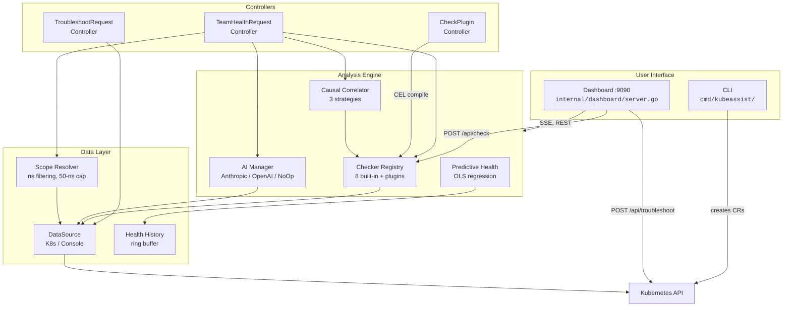
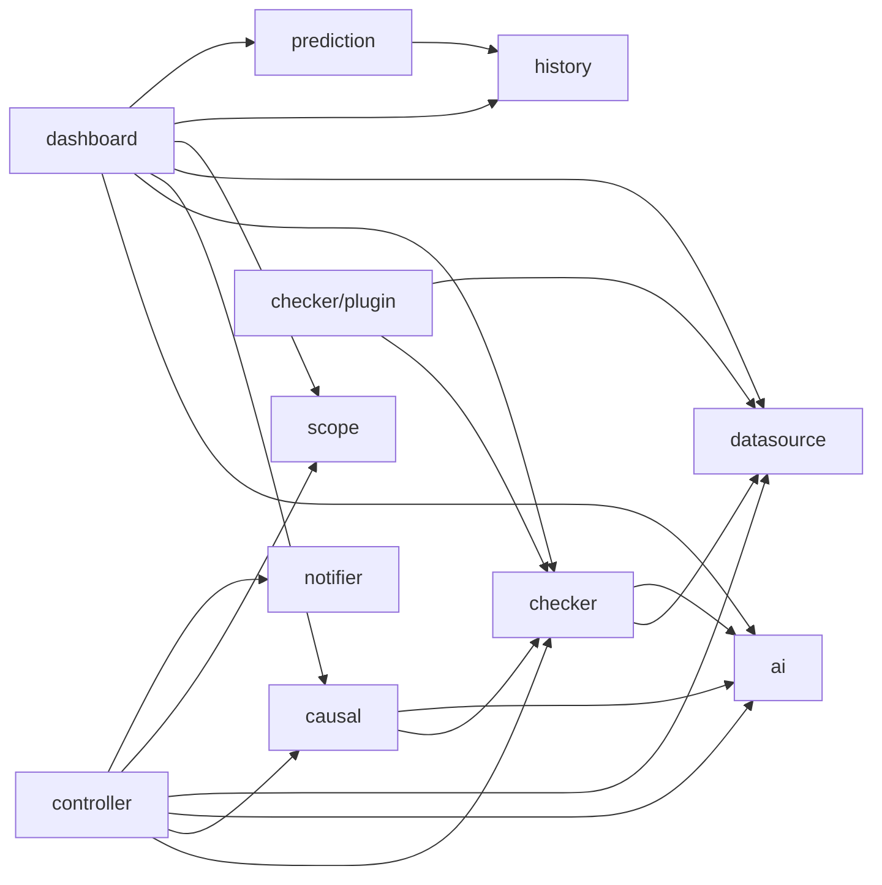
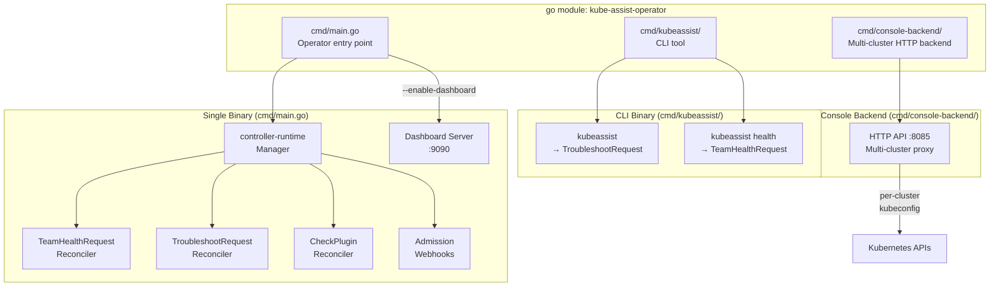

# System Overview

> Architecture diagrams for the KubeAssist operator — system context, package dependencies, and binary composition.

---

## A. System Context

How users interact with KubeAssist and how internal components connect.

> **Source anchors:** `cmd/main.go`, `cmd/kubeassist/`, `internal/controller/`, `internal/checker/`, `internal/causal/`, `internal/ai/`, `internal/dashboard/server.go`, `internal/datasource/`, `internal/prediction/`, `internal/scope/`, `internal/history/`

---

## B. Package Dependency Graph

How `internal/` packages import each other. Arrows point from importer to dependency.

> **Source anchors:** import statements in each package under `internal/`

---

## C. Binary Composition

KubeAssist ships three entry points compiled from a single Go module.

> **Source anchors:** `cmd/main.go` (manager setup, dashboard start, controller registration), `cmd/kubeassist/main.go` (CLI dispatch), `cmd/console-backend/main.go` (HTTP server with auth/TLS)
