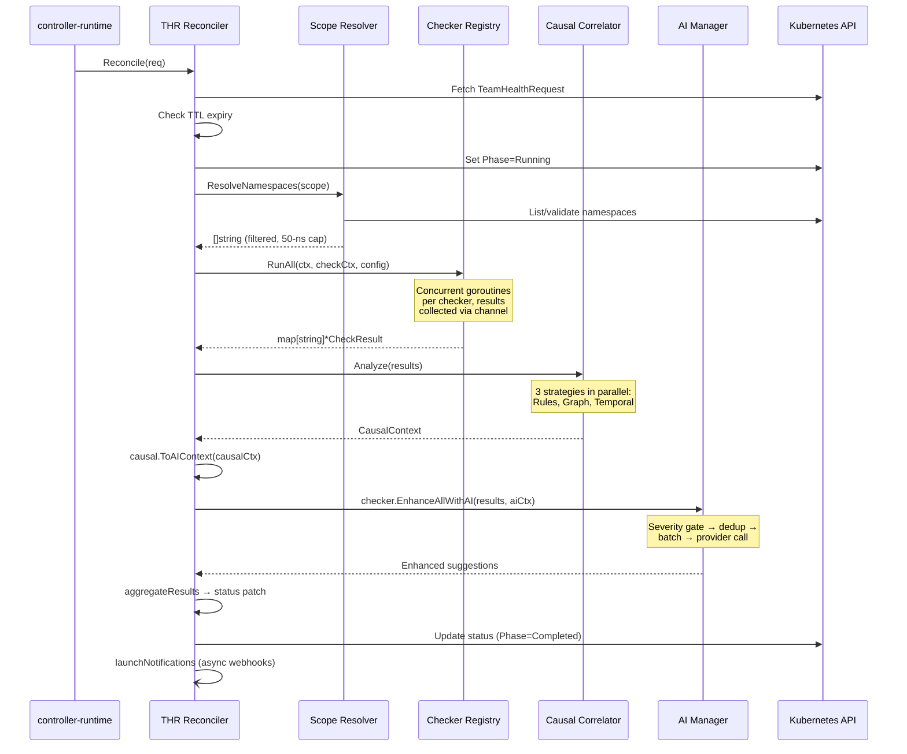
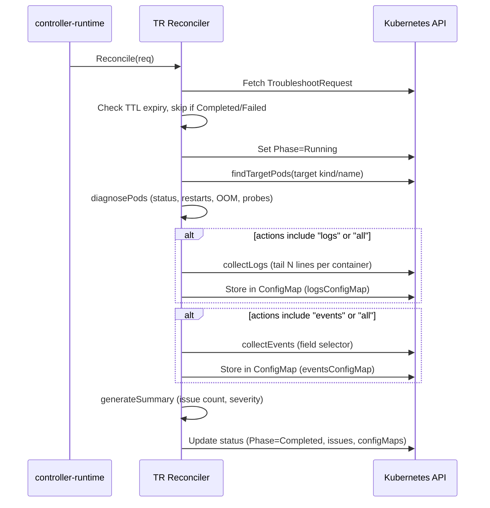
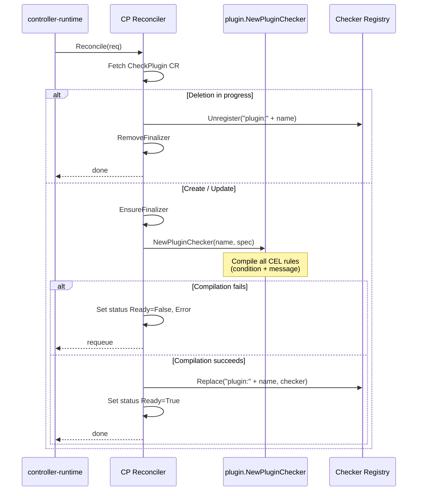
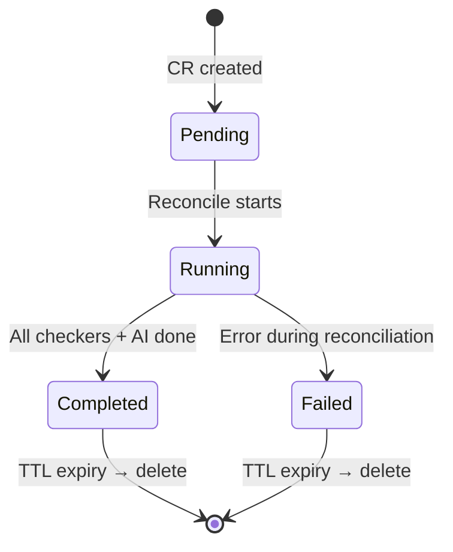
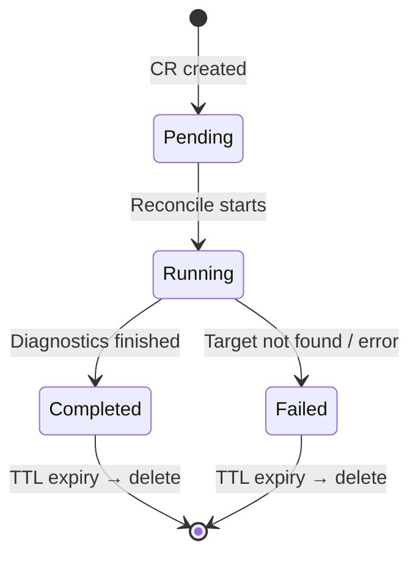
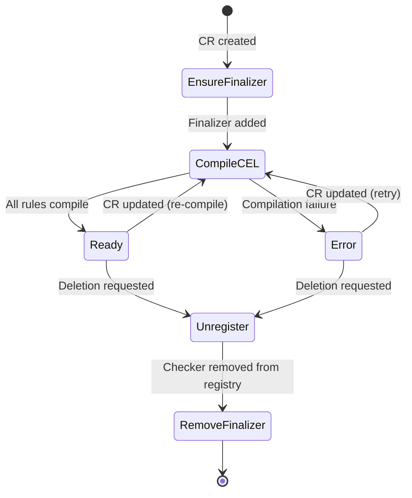

# Reconciliation Flows

> Controller lifecycles and CR state machines for all three KubeAssist controllers.

---

## A. TeamHealthRequest Full Pipeline

The most complex reconciliation — runs checkers, causal analysis, and AI enhancement across namespaces.

> **Source anchors:** `internal/controller/teamhealthrequest_controller.go` (Reconcile method), `internal/scope/resolver.go` (ResolveNamespaces), `internal/checker/registry.go` (RunAll), `internal/causal/correlator.go` (Analyze), `internal/checker/checker.go` (EnhanceAllWithAI)

---

## B. TroubleshootRequest Lifecycle

On-demand diagnostics for a specific workload target.

> **Source anchors:** `internal/controller/troubleshootrequest_controller.go` (Reconcile, findTargetPods, diagnosePods, collectLogs, collectEvents)

---

## C. CheckPlugin Lifecycle

CRD-driven custom health checks with CEL expressions and hot-reload into the registry.

> **Source anchors:** `internal/controller/checkplugin_controller.go` (Reconcile, finalizer handling), `internal/checker/plugin/checker.go` (NewPluginChecker, CEL compilation), `internal/checker/registry.go` (Replace, Unregister)

---

## D. CR State Machines

### TeamHealthRequest

> Phase constants: `TeamHealthPhasePending`, `TeamHealthPhaseRunning`, `TeamHealthPhaseCompleted`, `TeamHealthPhaseFailed`

### TroubleshootRequest

> Phase constants: `PhasePending`, `PhaseRunning`, `PhaseCompleted`, `PhaseFailed`

### CheckPlugin

> **Source anchors:** Phase constants in `api/v1alpha1/teamhealthrequest_types.go:215-218`, `api/v1alpha1/troubleshootrequest_types.go:83-86`, controller finalizer logic in `internal/controller/checkplugin_controller.go`
