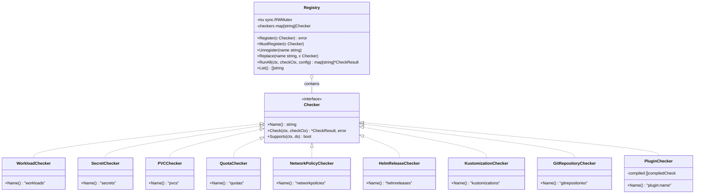
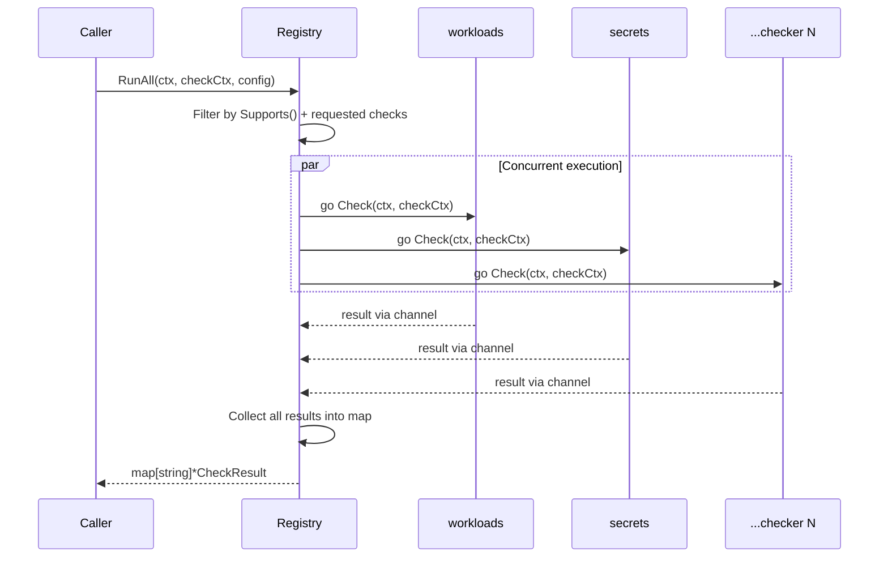
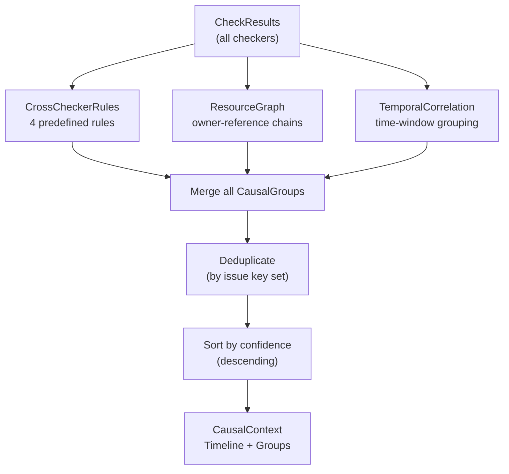
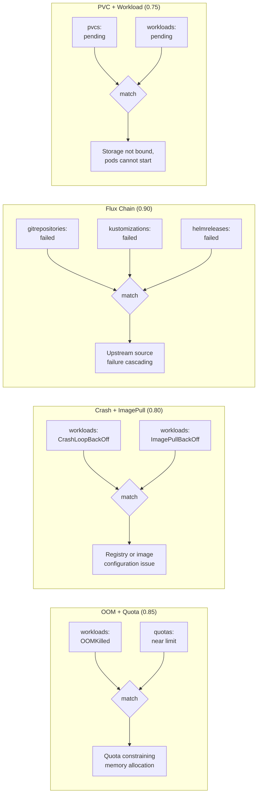
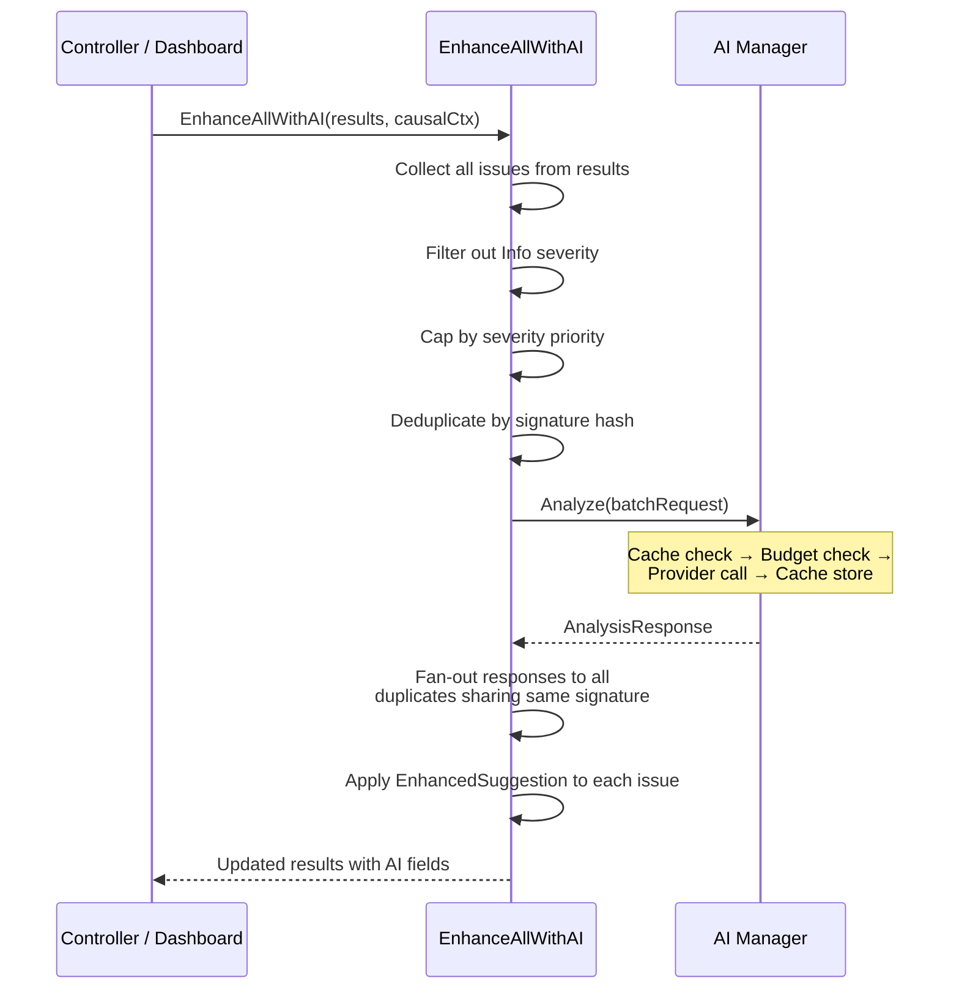

# Checker Registry & Causal Engine

> Checker interface, registry execution model, causal correlation pipeline, and AI batch enhancement.

---

## A. Checker Interface & Registry

All health checkers implement the `Checker` interface and register with the `Registry` at startup.

> **Source anchors:** `internal/checker/checker.go` (Checker interface, CheckResult, Issue types), `internal/checker/registry.go` (Registry struct), `internal/checker/workload/`, `internal/checker/resource/` (secrets, pvcs, quotas, networkpolicies), `internal/checker/flux/` (helmreleases, kustomizations, gitrepositories), `internal/checker/plugin/checker.go`

---

## B. Registry.RunAll Execution

`RunAll` spawns one goroutine per checker and collects results via a channel.

> **Source anchors:** `internal/checker/registry.go` (RunAll — goroutine fan-out, channel collection, Supports filtering)

---

## C. Causal Correlation Pipeline

Three strategies run in parallel, then results are merged, deduplicated, and sorted by confidence.

> **Source anchors:** `internal/causal/correlator.go` (Analyze method), `internal/causal/rules.go` (CrossCheckerRules strategy), `internal/causal/graph.go` (ResourceGraph strategy), `internal/causal/temporal.go` (TemporalCorrelation strategy)

---

## D. Cross-Checker Rules

Four predefined rules match issue tags across different checkers to surface root causes.

> **Source anchors:** `internal/causal/rules.go` (rule definitions with tag matchers and confidence scores)

---

## E. AI Batch Enhancement

`EnhanceAllWithAI` collects issues from all checkers, applies optimizations, then makes a single batched AI call.

> **Source anchors:** `internal/checker/checker.go` (EnhanceAllWithAI — severity gating, deduplication, signature hashing, fan-out), `internal/ai/manager.go` (Manager.Analyze — cache, budget, provider dispatch)
