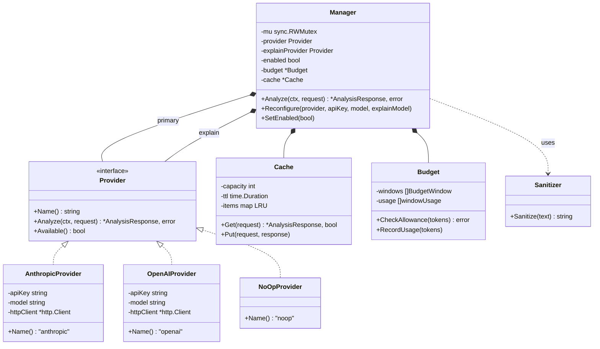
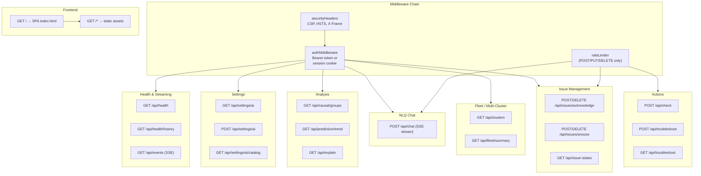
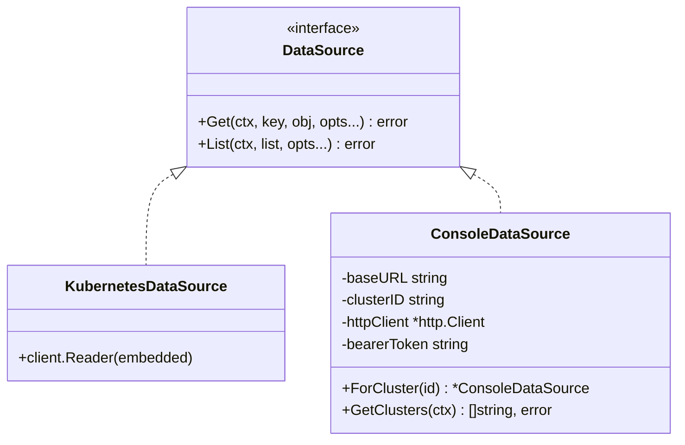
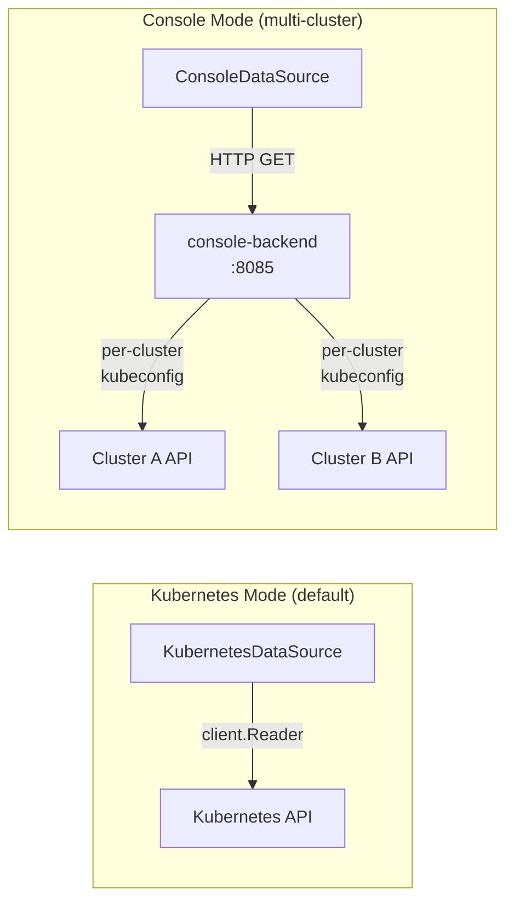
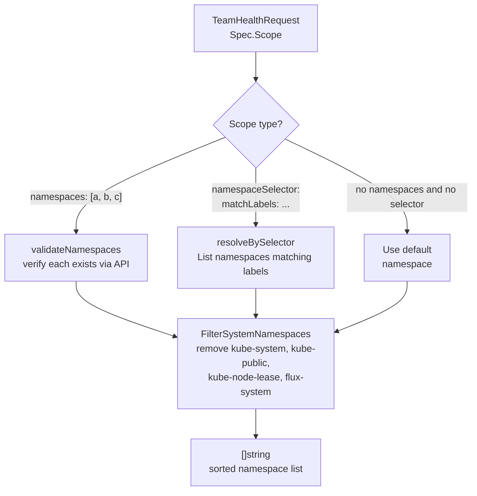

# AI, Dashboard & DataSource

> AI provider abstraction, optimization pipeline, dashboard HTTP routing, DataSource abstraction, and scope resolver.

---

## A. AI Provider Abstraction

Thread-safe `Manager` wraps a `Provider` interface with caching, budgeting, and runtime reconfiguration.

> **Source anchors:** `internal/ai/provider.go` (Provider interface, AnalysisRequest/Response types), `internal/ai/manager.go` (Manager struct), `internal/ai/anthropic.go`, `internal/ai/openai.go`, `internal/ai/noop.go`, `internal/ai/cache.go` (LRU + TTL, SHA256 key), `internal/ai/budget.go` (multi-window token tracking), `internal/ai/sanitize.go` (regex-based redaction)

---

## B. AI Pipeline with 9 Optimizations

Issues flow through a pipeline of cost-reduction optimizations before reaching the AI provider.

```mermaid
flowchart LR
    Issues["Raw<br/>Issues"] --> SevGate["1. Severity<br/>Gate"]
    SevGate -->|skip Info| ChangeOnly["2. Change-Only<br/>AI"]
    ChangeOnly -->|skip unchanged| Dedup["3. Cross-Issue<br/>Dedup"]
    Dedup --> Batch["4. Batch<br/>Grouping"]
    Batch --> Provider["5. Provider<br/>Call"]
    Provider --> PromptCache["6. Prompt<br/>Cache"]
    PromptCache --> TokenBudget["7. Token<br/>Budget"]
    TokenBudget --> LRUCache["8. LRU<br/>Response Cache"]
    LRUCache --> TieredRoute["9. Tiered<br/>Model Routing"]
    TieredRoute --> Response["Enhanced<br/>Response"]

    style SevGate fill:#f9f,stroke:#333
    style Dedup fill:#f9f,stroke:#333
    style LRUCache fill:#9f9,stroke:#333
    style TokenBudget fill:#ff9,stroke:#333
```

**Optimization summary:**

| # | Optimization | Where | Effect |
|---|-------------|-------|--------|
| 1 | Severity gate | `EnhanceAllWithAI` | Skip Info-level issues (~30% reduction) |
| 2 | Change-only AI | Dashboard `runAIAnalysisForCluster` | Skip AI when issue hash unchanged |
| 3 | Cross-issue dedup | `EnhanceAllWithAI` | Group identical patterns, send one representative |
| 4 | Batch grouping | `EnhanceAllWithAI` | Single API call for all issues |
| 5 | Provider call | `Manager.Analyze` | Dispatch to selected provider |
| 6 | Prompt cache | `AnthropicProvider` | `cache_control: ephemeral` header (~90% cost reduction) |
| 7 | Token budget | `Budget.CheckAllowance` | Daily/monthly caps with graceful `ErrBudgetExceeded` |
| 8 | LRU response cache | `Cache` | 100-entry, 5-min TTL, SHA256-keyed |
| 9 | Tiered routing | `Manager` | Separate models for analyze vs explain mode |

> **Source anchors:** `internal/ai/` package (all optimization files), `internal/checker/checker.go` (EnhanceAllWithAI), `internal/dashboard/server.go` (runAIAnalysisForCluster issue hash check)

---

## C. Dashboard HTTP Routing

The dashboard server exposes REST endpoints and SSE streaming, protected by auth middleware.

> **Source anchors:** `internal/dashboard/server.go` (buildHandler method — route registration, securityHeaders, authMiddleware, sseAuthMiddleware, rateLimiter)

---

## D. DataSource Abstraction

The `DataSource` interface abstracts Kubernetes API access, enabling both direct and cross-cluster modes.

In console mode, `cmd/console-backend` enforces auth/TLS by default (`--allow-insecure` is explicit dev-only bypass).

> **Source anchors:** `internal/datasource/datasource.go` (DataSource interface), `internal/datasource/kubernetes.go` (KubernetesDataSource), `internal/datasource/console.go` (ConsoleDataSource, GVK→resource mapping, URL building, ForCluster), `cmd/console-backend/main.go` (auth/TLS requirements)

---

## E. Scope Resolver

Resolves a `TeamHealthRequest.Spec.Scope` into a concrete list of namespaces to check.

Namespace capping is applied by the TeamHealthRequest controller (`MaxNamespaces = 50`), not in the resolver package.

> **Source anchors:** `internal/scope/resolver.go` (Resolver struct, ResolveNamespaces, validateNamespaces, resolveBySelector, FilterSystemNamespaces), `internal/controller/teamhealthrequest_controller.go` (`MaxNamespaces` truncation)
